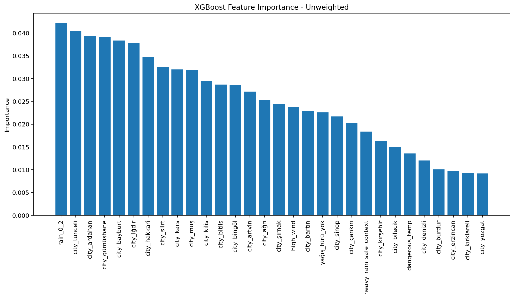
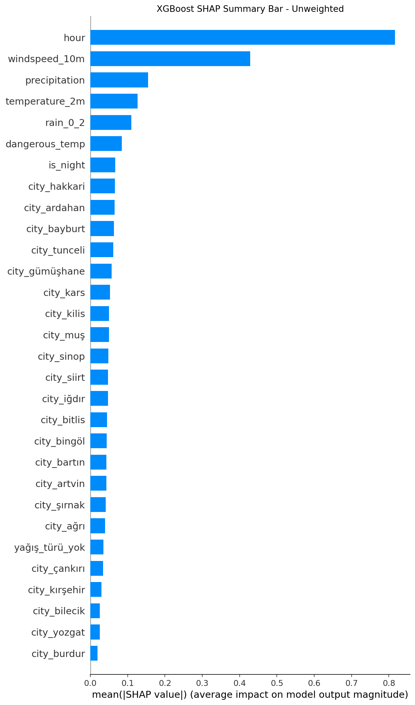
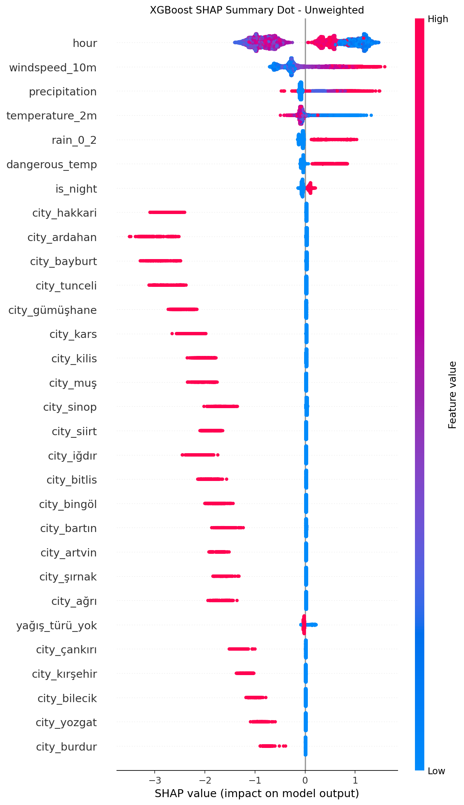
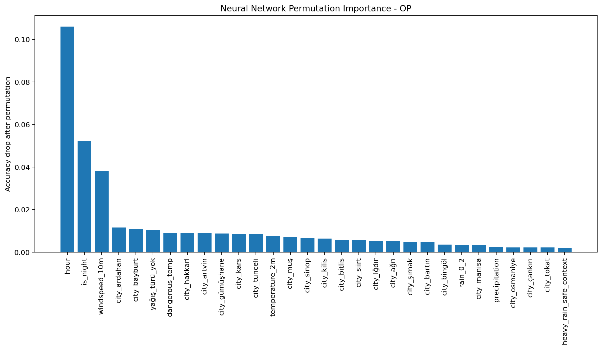
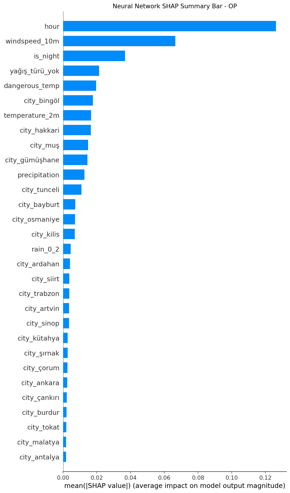
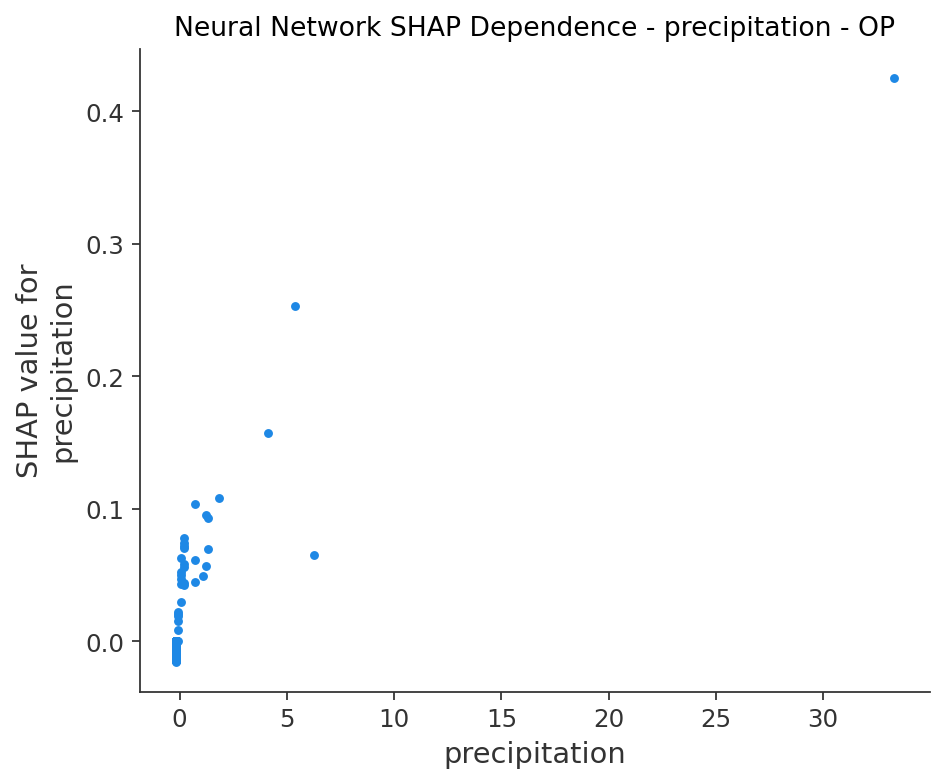

# Traffic Accident Prediction System

**Internship Project – DataBoss, ODTÜ Teknokent**

I built this project during my internship to model next-hour traffic accident risk from city-level weather data and yearly accident counts. The main challenge was that the available accident data was not timestamp-level event data. It only contained yearly accident totals per city, while the target task required an hourly binary prediction.

Because of that, the project became more than a standard model-training exercise. I had to design a labeling strategy, create a T+1 target, handle rare heavy-rain cases, compare multiple models, analyze their behavior, and deploy the selected model through an API and dashboard.

---

## What This Project Covers

- Hourly weather data collection for 81 Turkish cities
- City-level yearly accident count integration
- Risk-score-based hourly accident label generation
- T+1 next-hour binary target creation
- Heavy-rain focused feature engineering and augmentation
- Leakage-safe train/test splitting with grouped samples
- Model training with XGBoost, Random Forest, and Neural Network
- Model comparison using accuracy, recall, F1, ROC-AUC, and balanced accuracy
- Heavy-rain bin and context-specific evaluation
- SHAP, feature importance, and permutation importance analysis
- Flask API deployment
- Streamlit dashboards for XGBoost and Neural Network predictions

---

## Motivation

The first version of the project was able to train classifiers, but the model behavior around heavy rain was not reliable. Heavy-rain samples were rare, and precipitation did not behave like a simple linear risk signal.

The important modeling idea became this:

> Heavy rain should not automatically mean high accident risk. Its effect depends on context.

For example, after precipitation becomes greater than 5 mm, some drivers may slow down, drive more carefully, or avoid traffic. In other situations, such as night time, high wind, or dangerous temperature, heavy rain can still represent a high-risk condition.

To represent this behavior, I rebuilt the dataset and separated heavy-rain samples into safer and riskier contexts instead of treating precipitation as a simple “more rain = more accidents” feature.

---

## Repository Structure

```text
traffic-accident-prediction/
├── data/                         
│   ├── raw/
│   │   ├── accident_counts_2022_2024.csv
│   │   └── turkiye_il_koordinatlar.csv
│   ├── interim/
│   │   └── weather_all_cleaned.csv
│   └── processed/
│       ├── final_dataset_t+1.csv
│       ├── 02_corrected_augmented_dataset_t+1.csv
│       ├── train_corrected_augmented_dataset_t+1.csv
│       └── test_corrected_augmented_dataset_t+1.csv
├── models/
│   ├── train_new_dataset_basic/
│   └── train_new_dataset_op/
├── reports/
│   ├── figures/
│   │   └── op/
│   ├── results_train_new_dataset_basic/
│   └── results_train_new_dataset_op/
├── src/
│   ├── data_configurations/
│   │   ├── kaza_atama.py
│   │   ├── prepare_augmented_data.py
│   │   ├── ozellik_kontrol.py
│   │   ├── mm_kontrol.py
│   │   └── saganak.py
│   ├── training/
│   │   ├── train_new_dataset_basic.py
│   │   └── train_new_dataset_op.py
│   ├── analysis/
│   │   ├── feature_importance_op.py
│   │   ├── shap_XGb_NN_op.py
│   │   ├── nn_shap_dependency_op.py
│   │   └── pdp_saganak_op.py
│   ├── api/
│   │   └── flask_dep.py
│   └── dashboard/
│       ├── dashboard_xgb.py
│       └── dashboard_nn.py
├── requirements.txt
└── README.md
```

---


## Data Preparation

The dataset combines weather data, city coordinates, and yearly city-level accident counts.

- Weather data was collected hourly for 81 Turkish cities between 2022 and 2024.
- City latitude/longitude values were used while querying weather data.
- Yearly accident counts were used as the source for label generation.
- The final target was shifted into a T+1 structure, meaning the model predicts whether an accident may occur in the next hour.

The `data/` directory is excluded from GitHub with `.gitignore` because it contains large CSV files. The source code, reports, figures, and analysis outputs are kept in the repository, while dataset filenames are documented below for reproducibility.

### Local Data Files

#### Raw data

```text
data/raw/accident_counts_2022_2024.csv
data/raw/turkiye_il_koordinatlar.csv
```

#### Interim data

```text
data/interim/weather_all_cleaned.csv
```

#### Processed data

```text
data/processed/final_dataset_t+1.csv
data/processed/02_corrected_augmented_dataset_t+1.csv
data/processed/train_corrected_augmented_dataset_t+1.csv
data/processed/test_corrected_augmented_dataset_t+1.csv
```

| File | Purpose |
|---|---|
| `accident_counts_2022_2024.csv` | Yearly city-level accident counts used for label generation |
| `turkiye_il_koordinatlar.csv` | Turkish city coordinate data used for weather collection |
| `weather_all_cleaned.csv` | Cleaned hourly weather data after API collection |
| `final_dataset_t+1.csv` | First processed dataset with the T+1 accident target |
| `02_corrected_augmented_dataset_t+1.csv` | Corrected augmented dataset with heavy-rain context samples and leakage-control identifiers |
| `train_corrected_augmented_dataset_t+1.csv` | Final training split |
| `test_corrected_augmented_dataset_t+1.csv` | Final test split |

---

## Labeling Strategy

The project does not use exact accident timestamps. I converted yearly city-level accident counts into hourly binary labels using a risk-score-based probabilistic assignment strategy.

The risk score was influenced by:

- precipitation
- temperature
- wind speed
- rain/snow type
- night hours
- evening hours

For each city-year group, the number of positive labels was capped to avoid assigning unrealistic accident frequency.

```python
max_allowed = int(len(sub_df) * MAX_POSITIVE_RATE)
allowed = min(count, max_allowed)
```

Where:

- `sub_df` is the hourly data for one city-year group
- `count` is the yearly accident count for that city-year
- `MAX_POSITIVE_RATE` is fixed at 60%
- `allowed` is the final maximum number of positive labels assigned to that group

After generating the current-hour accident label, I shifted the target by one hour within each city:

```python
df = df.sort_values(by=["city", "time"])
df["accident_happened_t+1"] = df.groupby("city")["accident_happened"].shift(-1)
```

This turns the task into:

> Given the current city and weather conditions, predict next-hour accident risk.

---

## Heavy-Rain Augmentation

Heavy-rain cases were rare in the original dataset. If I trained directly on that distribution, the model could either ignore heavy rain or learn an overly simple rule.

I corrected this by creating controlled augmented samples for two different heavy-rain contexts.

| Context | Description |
|---|---|
| Safe heavy-rain context | Heavy rain exists, but temperature, wind speed, and hour are relatively normal |
| Risky heavy-rain context | Heavy rain appears together with additional risk factors such as night time, high wind, or dangerous temperature |

This design helps the model learn that heavy rain is not always enough by itself. The surrounding context matters.

To reduce leakage risk, each original row has a `source_id`. Augmented rows keep the same `source_id` as their original row. The train/test split is then created with `GroupShuffleSplit`, so an original row and its augmented versions cannot be split across train and test sets.

A more detailed explanation is available in:

```text
reports/HEAVY_RAIN_AUGMENTATION.md
```

---

## Feature Engineering

The final training pipeline uses categorical, numeric, and binary engineered features.

### Categorical features

```python
cat_cols = ["city", "yağış_türü"]
```

These are encoded with:

```python
OneHotEncoder(handle_unknown="ignore")
```

### Numeric features

```python
num_cols = [
    "hour",
    "temperature_2m",
    "windspeed_10m",
    "precipitation"
]
```

These are scaled with:

```python
StandardScaler()
```

### Binary engineered features

```python
binary_cols = [
    "is_night",
    "dangerous_temp",
    "high_wind",
    "is_saganak",
    "rain_0_2",
    "rain_2_5",
    "rain_5_10",
    "rain_gt_10",
    "heavy_rain_safe_context",
    "heavy_rain_risky_context",
    "heavy_rain_high_wind",
    "heavy_rain_night"
]
```

Binary features are not scaled. They are concatenated directly with scaled numeric features and one-hot encoded categorical features.

The final feature order is saved with the model artifacts so the API and dashboards use the same input structure as training.

---

## Model Development

I trained and compared three model families:

- XGBoost
- Random Forest
- Neural Network

Logistic Regression was removed from the final comparison because the final feature set depends heavily on non-linear context interactions. Tree-based models and neural networks were more suitable for this version of the problem.

The final repository contains two main training runs:

| Training Run | Description |
|---|---|
| `train_new_dataset_basic` | Baseline training on the corrected augmented dataset |
| `train_new_dataset_op` | Optimized training on the corrected augmented dataset |

---

## Final Model Results

The final optimized run is:

```text
train_new_dataset_op
```

| Model | Accuracy | Balanced Accuracy | Precision | Recall | F1 | ROC-AUC |
|---|---:|---:|---:|---:|---:|---:|
| XGBoost | 0.7710 | 0.7723 | 0.7330 | 0.7895 | 0.7602 | 0.8469 |
| Random Forest | 0.7316 | 0.7274 | 0.7232 | 0.6747 | 0.6981 | 0.8098 |
| Neural Network | 0.7713 | 0.7722 | 0.7361 | 0.7836 | 0.7591 | 0.8473 |

The Neural Network achieved slightly higher accuracy and ROC-AUC, but I selected **XGBoost** as the deployed model.

The reason was not only global score. XGBoost gave a better balance between:

- positive-class recall
- F1-score
- heavy-rain behavior

The deployed model is:

```text
models/train_new_dataset_op/xgboost_train_new_dataset_op.pkl
```

---

## Basic vs Optimized Training

| Model | Run | Accuracy | Precision | Recall | F1 | ROC-AUC |
|---|---|---:|---:|---:|---:|---:|
| XGBoost | basic | 0.7705 | 0.7324 | 0.7893 | 0.7598 | 0.8466 |
| XGBoost | op | 0.7710 | 0.7330 | 0.7895 | 0.7602 | 0.8469 |
| Random Forest | basic | 0.7347 | 0.7106 | 0.7139 | 0.7122 | 0.8071 |
| Random Forest | op | 0.7316 | 0.7232 | 0.6747 | 0.6981 | 0.8098 |
| Neural Network | basic | 0.7494 | 0.7113 | 0.7660 | 0.7376 | 0.8250 |
| Neural Network | op | 0.7713 | 0.7361 | 0.7836 | 0.7591 | 0.8473 |

The most visible improvement came from the Neural Network pipeline. The optimized version used manual stratified validation, dropout, early stopping, learning-rate reduction, lower learning rate, and larger batch size.

---

## Heavy-Rain Bin Evaluation

Since heavy rain was one of the main modeling concerns, I evaluated predictions separately by precipitation interval.

### XGBoost precipitation bin results

| Precipitation Bin | True Positive Ratio | Predicted Positive Ratio | Accuracy | Precision | Recall | F1 |
|---|---:|---:|---:|---:|---:|---:|
| 0–2mm | 0.4596 | 0.4951 | 0.7688 | 0.7307 | 0.7872 | 0.7579 |
| 2–5mm | 0.7247 | 0.7984 | 0.8147 | 0.8378 | 0.9230 | 0.8784 |
| 5–10mm | 0.2828 | 0.2735 | 0.9625 | 0.9485 | 0.9173 | 0.9327 |
| >10mm | 0.3068 | 0.3019 | 0.9710 | 0.9600 | 0.9449 | 0.9524 |

The key result is that the model does not treat heavy rain as an automatic positive label. In the 5–10mm and >10mm ranges, the predicted positive ratios are close to the true positive ratios.

---

## Heavy-Rain Context Evaluation

I also evaluated specific heavy-rain context flags.

### XGBoost context results

| Context | Value | True Positive Ratio | Predicted Positive Ratio | Accuracy | Precision | Recall | F1 |
|---|---:|---:|---:|---:|---:|---:|---:|
| `heavy_rain_safe_context` | 1 | 0.0230 | 0.0015 | 0.9784 | 1.0000 | 0.0635 | 0.1194 |
| `heavy_rain_risky_context` | 1 | 0.9557 | 0.9825 | 0.9567 | 0.9643 | 0.9914 | 0.9777 |
| `heavy_rain_high_wind` | 1 | 0.9656 | 0.9809 | 0.9618 | 0.9728 | 0.9881 | 0.9804 |
| `heavy_rain_night` | 1 | 0.9568 | 0.9852 | 0.9593 | 0.9649 | 0.9935 | 0.9790 |

These results support the main design decision: heavy rain is interpreted through surrounding context, not as a standalone risk rule.

---

## Model Interpretability

The final analysis focuses on XGBoost and Neural Network behavior.

Generated outputs include:

- XGBoost feature importance
- XGBoost SHAP summary bar plot
- XGBoost SHAP summary dot plot
- Neural Network permutation importance
- Neural Network SHAP summary bar plot
- Neural Network SHAP dependence plot for precipitation

### XGBoost Feature Importance

<p align="center">
  
</p>

### XGBoost SHAP Summary Bar

<p align="center">
  
</p>

### XGBoost SHAP Summary Dot

<p align="center">
  
</p>

### Neural Network Permutation Importance

<p align="center">
  
</p>

### Neural Network SHAP Summary Bar

<p align="center">
  
</p>

### Neural Network SHAP Dependence on Precipitation

<p align="center">
  
</p>

---

## Flask API

The deployed API uses the optimized XGBoost model.

Run:

```bash
python src/api/flask_dep.py
```

### Example Request

```json
{
  "city": "Ankara",
  "yağış_türü": "yağmur",
  "hour": 17,
  "temperature_2m": 24.5,
  "windspeed_10m": 12.3,
  "precipitation": 3.2
}
```

### Example Response

```json
{
  "prediction": 1,
  "probability": 0.7821
}
```

The API computes engineered features such as `is_saganak`, `heavy_rain_safe_context`, and `heavy_rain_risky_context` before prediction.

---

## Streamlit Dashboards

The repository includes dashboards for both XGBoost and Neural Network predictions.

```text
src/dashboard/dashboard_xgb.py
src/dashboard/dashboard_nn.py
```

The dashboard takes user-facing inputs:

- city
- hour
- temperature
- wind speed
- precipitation amount
- precipitation type

It then computes the engineered features internally and returns an accident-risk prediction.

Run XGBoost dashboard:

```bash
streamlit run src/dashboard/dashboard_xgb.py
```

Run Neural Network dashboard:

```bash
streamlit run src/dashboard/dashboard_nn.py
```

---

## How to Run

### 1. Clone the repository

```bash
git clone https://github.com/CodeByDuhan/traffic-accident-prediction.git
cd traffic-accident-prediction
```

### 2. Create and activate a virtual environment

```bash
python -m venv venv
source venv/bin/activate
```

### 3. Install dependencies

```bash
pip install -r requirements.txt
```

### 4. Run the Flask API

```bash
python src/api/flask_dep.py
```

### 5. Run dashboards

```bash
streamlit run src/dashboard/dashboard_xgb.py
streamlit run src/dashboard/dashboard_nn.py
```

---

## Limitations

This model should be interpreted as a weather- and context-based accident risk prototype, not as a production-grade traffic safety system.

Main limitations:

- It does not use exact timestamp-level accident event records.
- Hourly labels are generated from yearly city-level accident counts.
- The heavy-rain augmentation strategy is based on a modeling hypothesis about driver behavior under high precipitation.
- The results show model behavior on the constructed dataset, not guaranteed real-world accident causality.

---

## Developer

**Duhan Aydın**  
Computer Engineering Graduate  
Intern at DataBoss, ODTÜ Teknokent

This repository represents an end-to-end machine learning workflow: data preparation, label construction, contextual feature engineering, model comparison, error-focused evaluation, interpretability, API deployment, and dashboard development.
