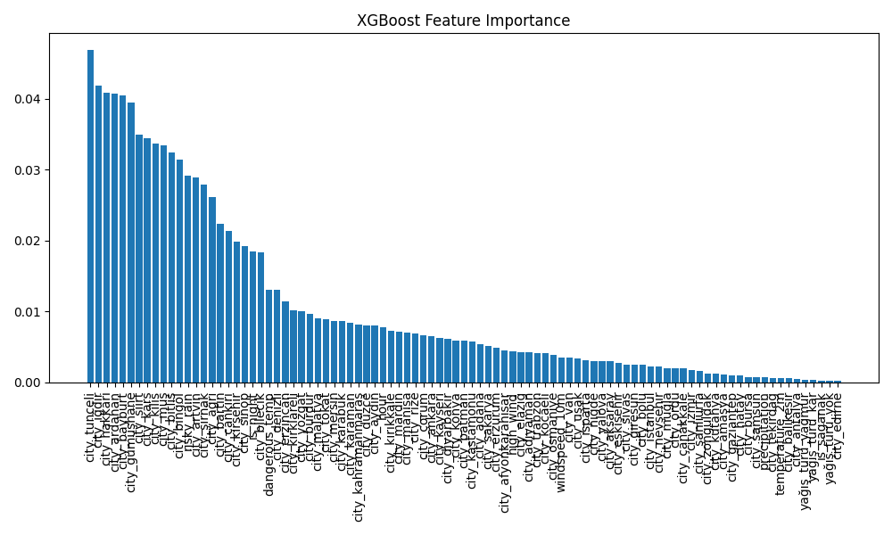
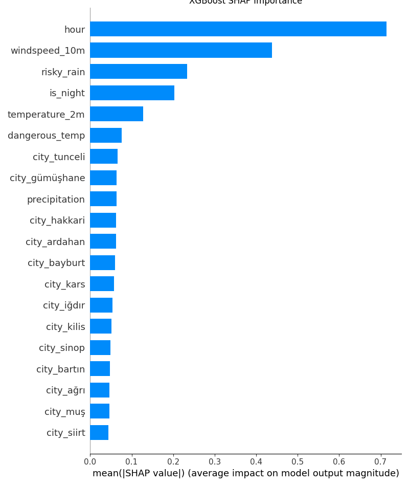
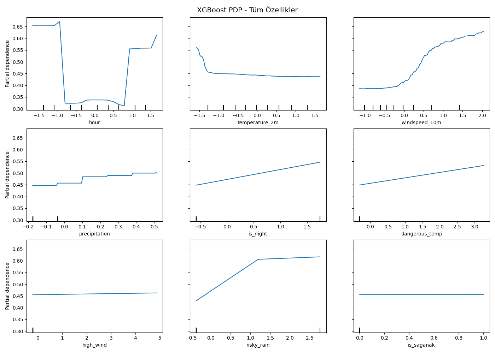
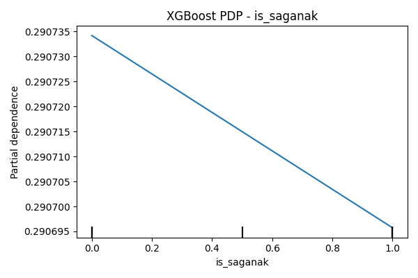
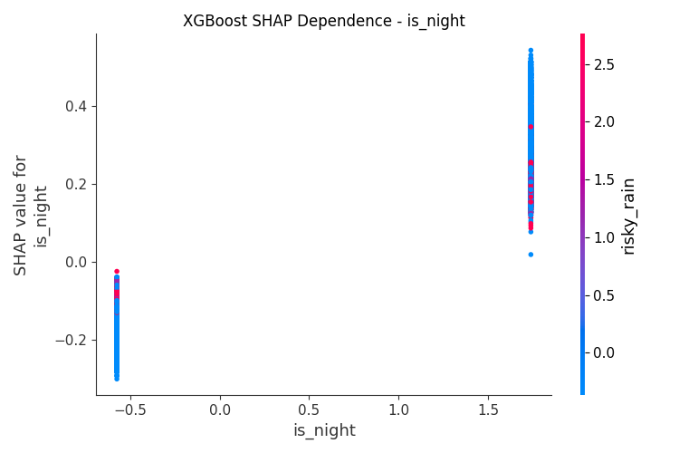
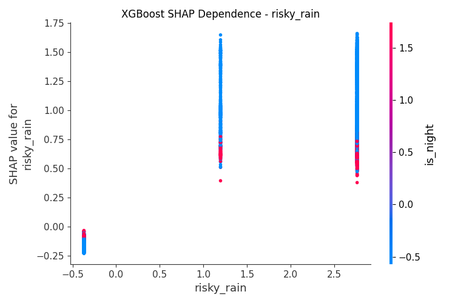
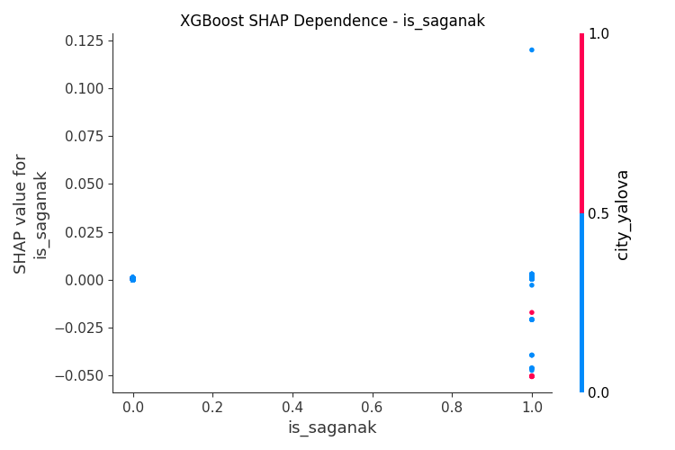
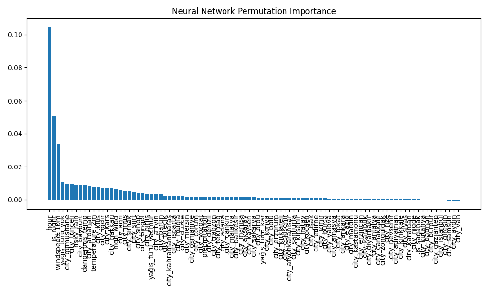

# Traffic Accident Prediction System  
**Internship Project – DataBoss, ODTÜ Teknokent**

Hello, this project is a traffic accident prediction system that I developed during my internship.  
My goal was to predict whether a traffic accident would occur in the **next hour**, using **city-level hourly weather data**.

This repository contains the full development pipeline I used throughout the project, including:
- data collection and preprocessing
- feature engineering and labeling
- model training and evaluation
- model interpretability analysis
- Flask API deployment
- Streamlit dashboards

## Project Motivation

For me, this project was not only about building a prediction model.  
I also wanted to achieve the following:

- compare different models and identify the most effective approach
- work with real-world data and perform practical data engineering
- deploy a trained model as an API
- understand model behavior through SHAP and PDP analysis
- build dashboards for end users

## Data Collection and Preparation

This project required me to build a meaningful dataset from scratch.

- I collected hourly weather data using the Open-Meteo API.
- Since Open-Meteo works with coordinates, I first gathered latitude and longitude information for Turkish cities in `turkiye_il_koordinatlar.csv`.
- Using those coordinates, I collected hourly weather data for **81 cities** between **2022 and 2024**.
- I then integrated yearly city-based traffic accident counts from TÜİK in `accident_counts_2022_2024.csv`.
- As a result, I obtained a dataset that combines hourly observations with yearly accident count information.

Because some datasets are large, only the main project data files are included in the repository.

## Weather Type Simplification

The `weathercode` feature returned by Open-Meteo contains many different categories.  
To simplify the learning process, I converted it into three broader groups:

- `rain`
- `snow`
- `none`

This made it easier for the model to interpret weather conditions.

## Data Augmentation: `is_saganak`

In the early stage, the model struggled to learn the `is_saganak` feature, which represents heavy rain.

The main reason was that this condition was relatively rare in the dataset.  
To address this, I:

- filtered rows where `is_saganak = 1`
- duplicated those rows with a controlled ratio and added them back into the dataset

This allowed the model to see heavy-rain cases more often and learn the feature more meaningfully.

It also supported a real-world assumption I considered during the project:  
when rainfall becomes extremely heavy, drivers may behave more cautiously and reduce their speed, which can lower accident probability.

## Model Development Process

I planned model development in three stages:

1. `basic` — baseline models without additional optimization  
2. `op` — improved version with feature engineering and hyperparameter tuning  
3. `op2` — final version with extended features and stronger binary indicators  

This staged approach was inspired by a previous CNN project of mine, where I also improved performance step by step.  
However, because this project uses tabular data rather than images, the performance gains between stages were more incremental.

### Logistic Regression

I initially included Logistic Regression as well, but later removed it because:

- it could not capture non-linear relationships effectively
- its performance was significantly lower than the other models

For that reason, it is no longer part of the final repository pipeline.

## Model Results

| Model | Version | Accuracy | Precision | Recall |
|-------|---------|----------|-----------|--------|
| XGBoost | basic | 0.7714 | 0.7324 | 0.7897 |
| XGBoost | optimized | 0.7713 | 0.7319 | 0.7904 |
| **XGBoost** | **optimized2** | **0.7951** | **0.7434** | **0.8490** |
| Neural Network | optimized2 | 0.8013 | 0.7634 | 0.8253 |

My final deployed model is **XGBoost (op2)**.  
I kept **Neural Network (op2)** as an alternative dashboard model.

## Labeling Strategy and the 60% Constraint

The original accident data was available as **yearly accident counts per city**.  
If I had directly mapped those counts to hourly rows, the problem would have behaved more like regression.

Since I wanted to build a classification model, I distributed accidents across hourly rows using a **risk-score-based probabilistic sampling approach**.

In other words:

> I distributed accident labels according to the estimated accident risk derived from hourly weather conditions.

At the same time, I needed to control the distribution.  
If I assigned too many positive labels, the model could overfit.  
For that reason, I limited the number of positive labels to either:

- the real yearly accident count for that city-year, if it stayed below the cap
- or a maximum of **60% of total hourly observations** for that city-year

### Label Count Logic

While assigning accidents, using only the TÜİK yearly count was not enough.  
To keep learning more balanced, I used the following logic for each city-year subset:

```python
max_allowed = int(len(sub_df) * MAX_POSITIVE_RATE)
allowed = min(count, max_allowed)
```

Where:

- `sub_df` is the hourly data for a given city-year
- `count` is the yearly accident count from TÜİK
- `MAX_POSITIVE_RATE` is fixed at 60%
- `allowed` is the maximum number of positive labels I allow for that city-year

This helped me stay consistent with real accident counts while also preventing the dataset from becoming too imbalanced.

## Model Interpretability

To understand how the final models behaved, I generated SHAP, PDP, and feature importance visualizations.

In the global view, I observed that low-frequency features tended to appear lower than more common features.  
However, when I inspected them separately, I could still see that they contributed meaningfully to model behavior.

The main features I focused on were:

- `is_saganak`
- `dangerous_temp`
- `risky_rain`
- `is_night`

### XGBoost Feature Importance

<p align="center">
  
</p>

### XGBoost SHAP Summary

<p align="center">
  
</p>

### XGBoost Partial Dependence Plot

<p align="center">
  
</p>

### Heavy Rain Effect: `is_saganak`

<p align="center">
  
</p>

### SHAP Dependence on `is_night`

<p align="center">
  
</p>

### SHAP Dependence on `risky_rain`

<p align="center">
  
</p>

### SHAP Dependence on `is_saganak`

<p align="center">
  
</p>

### Neural Network Permutation Importance

<p align="center">
  
</p>

## Flask API

The deployed API uses the **XGBoost op2** model.

Run:

```bash
python src/api/flask_dep.py
```

### Example Request

```json
{
  "city": "Ankara",
  "yağış_türü": "yağmur",
  "hour": 17,
  "temperature_2m": 24.5,
  "windspeed_10m": 12.3,
  "precipitation": 3.2
}
```

### Example Response

```json
{
  "prediction": 1,
  "probability": 0.7821
}
```

## Dashboards

I also prepared two separate Streamlit dashboards:

- `src/dashboard/dashboard_xgb.py` for XGBoost
- `src/dashboard/dashboard_nn.py` for Neural Network

Both dashboards:
- take city and weather inputs from the user
- compute derived features such as `is_saganak`, `risky_rain`, and `dangerous_temp` in the backend
- return accident predictions interactively

## Repository Structure

```text
traffic-accident-prediction/
├── data/
│   ├── raw/
│   │   ├── accident_counts_2022_2024.csv
│   │   └── turkiye_il_koordinatlar.csv
│   ├── interim/
│   │   └── weather_all_cleaned.csv
│   └── processed/
│       ├── final_dataset_t+1.csv
│       └── augmented_final_dataset_t+1.csv
├── models/
│   ├── op/
│   └── op2/
├── reports/
│   ├── figures/
│   ├── results_basic/
│   ├── results_op/
│   └── results_op2/
├── src/
│   ├── data_configurations/
│   ├── training/
│   ├── analysis/
│   ├── dashboard/
│   └── api/
├── requirements.txt
└── README.md
```

## How to Run

### 1. Clone the repository

```bash
git clone https://github.com/CodeByDuhan/traffic-accident-prediction.git
cd traffic-accident-prediction
```

### 2. Create and activate a virtual environment

```bash
python -m venv venv
source venv/bin/activate
```

On Windows:

```bash
venv\Scripts\activate
```

### 3. Install dependencies

```bash
pip install -r requirements.txt
```

If you want to run the dashboards or neural network scripts and your local environment does not already include them, you may also need:

```bash
pip install streamlit tensorflow
```

### 4. Run the Flask API

```bash
python src/api/flask_dep.py
```

### 5. Run the dashboards

XGBoost dashboard:

```bash
streamlit run src/dashboard/dashboard_xgb.py
```

Neural Network dashboard:

```bash
streamlit run src/dashboard/dashboard_nn.py
```

### 6. Run training scripts

```bash
python src/training/train_basic.py
python src/training/train_op.py
python src/training/train_op2.py
```

### 7. Run analysis scripts

```bash
python src/analysis/feature_importance.py
python src/analysis/pdp.py
python src/analysis/pdp_saganak.py
python src/analysis/xgb_shap_dependecy_plot.py
python src/analysis/nn_shap_dependecy.py
python src/analysis/shap_RF_XGb_NN.py
```

## Developer Information

Duhan Aydın  
Computer Engineering Graduate  
Intern at DataBoss, ODTÜ Teknokent

This project reflects my effort to build not only a working machine learning model, but also a full pipeline that includes data preparation, controlled labeling, interpretability, deployment, and user-facing interfaces.
